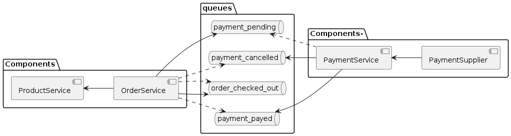
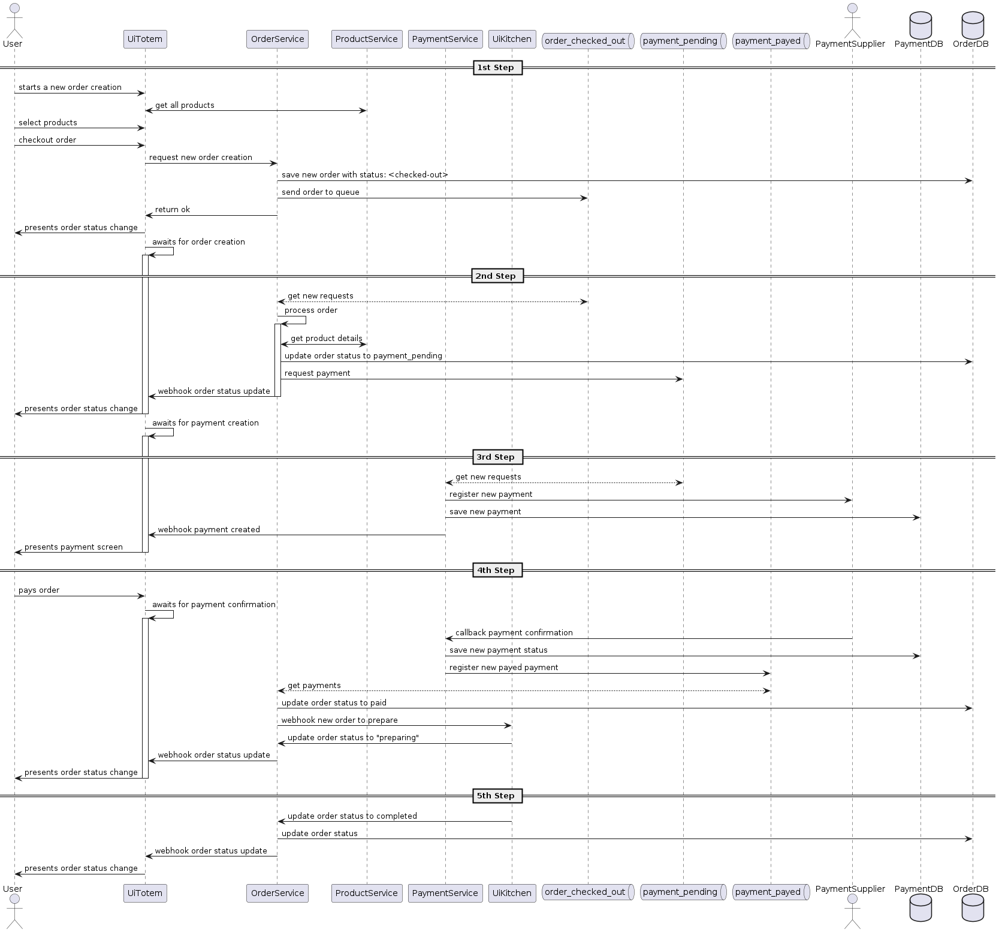
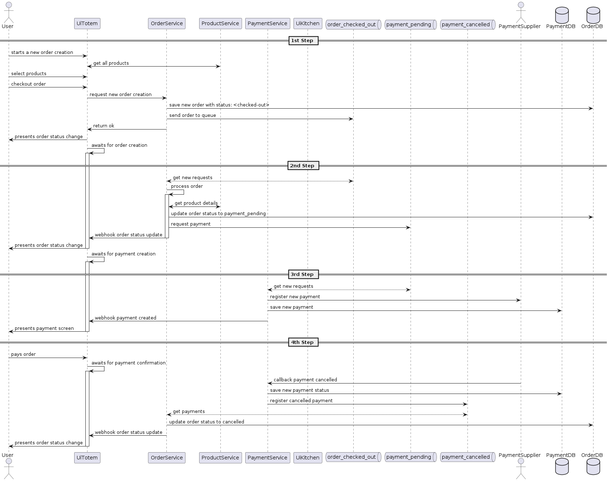

# FIAP - Tech Challenge V

PARA VISUALIZAÇÃO DAS IMAGENS, UMA CÓPIA DESTE README ENCONTRA-SE EM: [LINK README_ENTREGA_5](https://github.com/arceruiz/tech-challenge-order/blob/main/docs/README_ENTREGA_5.md)

## Integrantes
- Lucas Arce Ruiz - RM349580
- Mauricio Gonçalves Pires Jr - RM349581

# Challenge 5 Entregáveis:

- Link do Github com todos os microsserviços desenvolvidos e a orquestração;
- Dentro do seu código, o ReadMe deve conter:
    - Instruções para rodar a sua aplicação, usando o orquestrador de container que preferir;
    - Justificativa do padrão SAGA escolhido;
    - Links com os relatórios dos processamentos do OWASP ZAP (antes e após a correção);
    - Link com o relatório RIPD do sistema;
    - Link para o desenho da arquitetura;
    - Link para um vídeo com:
        - O projeto rodando, inclusive com o padrão SAGA funcionando;
        - Explicação do padrão SAGA escolhido e sua justificativa;
        - Arquitetura da estrutura da nuvem e como a comunicação SAGA está montada.

# Video de Apresentação

Fizemos um video mostrando todos os pontos do projeto e está compartilhado em: https://drive.google.com/drive/folders/1J2OHfgty_4C_EDLeBaz1tThqovpAMWH5?usp=sharing

# Links para os Repos

- Payment
    - [Payment Service](https://github.com/arceruiz/tech-challenge-payment)
    - [Payment Service GitOps](https://github.com/mauriciodm1998/payment-service-gitops)
- Order
    - [Order Service](https://github.com/arceruiz/tech-challenge-order)
    - [Order Service GitOps](https://github.com/mauriciodm1998/order-service-gitops)
- Product
    - [Product Service](https://github.com/arceruiz/tech-challenge-product)
    - [Product Service GitOps](https://github.com/mauriciodm1998/product-service-gitops)
- User
    - [User Service](https://github.com/mauriciodm1998/user-service)
    - [User Service GitOps](https://github.com/mauriciodm1998/user-service-gitops)
- [Auth Service](https://github.com/mauriciodm1998/auth-service)
- [Link](https://github.com/mauriciodm1998/auth-service) para repositorio do Lambda
- [Link](https://github.com/mauriciodm1998/tech-challenge-gitops) para repositorio Infra com Terraform

# Demais Links

- [Relatorio OWASP ZAP](https://drive.google.com/drive/folders/1LEQYRtPAx6eq7VyX0RtWgALFcyuercXA)
- [Relatorio RIPD](https://drive.google.com/drive/folders/1LEQYRtPAx6eq7VyX0RtWgALFcyuercXA)
- [Desenho da arquitetura](https://drive.google.com/drive/folders/1LEQYRtPAx6eq7VyX0RtWgALFcyuercXA)
- [Vídeo de apresentação](https://drive.google.com/drive/folders/1LEQYRtPAx6eq7VyX0RtWgALFcyuercXA)

## PADRÃO SAGA ESCOLHIDO:

Optamos por essa abordagem devido às suas inúmeras vantagens que se alinham com os requisitos e desafios do nosso sistema, como a utilização de requisições assíncronas garantindo confiabilidade nas operações para que mesmo em situações de alta carga, as transações possam ser processadas de forma eficiente e sem interrupções. Tolerância a falhas com ações compensatórias permitindo lidar com possíveis falhas de forma melhor estruturada, mitigando problemas que surjam durante o processo de transação, mantendo a integridade e a consistência do sistema. Escalabilidade, facilitando o dimensionamento conforme o crescimento do sistema. Enfim, otimizando o desempenho por lidar de forma eficaz com transações em grande volume garantindo uma experiência fluida para os usuários do fast food.

Quanto à escolha específica da versão Coreografada do padrão SAGA, decidimos por essa abordagem devido à natureza da nossa arquitetura, que consiste em poucas sagas, portanto uma abordagem mais simplista onde serviços publicam eventos quando ocorre uma alteração significativa em seu estado, permitindo que os demais serviços sejam assim notificados das alterações e poderem (ou não) agir; e também mantem o baixo acoplamento entre os serviços, que não precisam se comunicar diretamente entre sí, facilitando com que um possa ser alterado sem necessariamente afetar os demais. Nesse contexto, a adoção de um orquestrador apenas aumentaria a complexidade da implementação, sem trazer benefícios significativos para o projeto.

## Diagrama de componentes SAGA:

## Diagrama De fluxo:

### "Caminho feliz":

### "Fluxo de pagamento cancelado"

